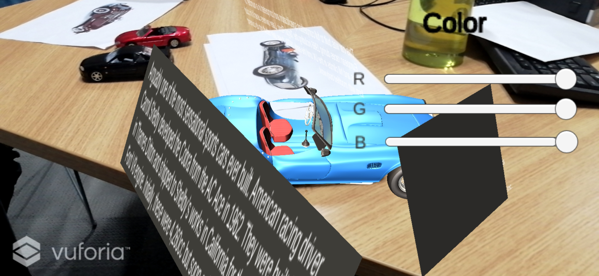
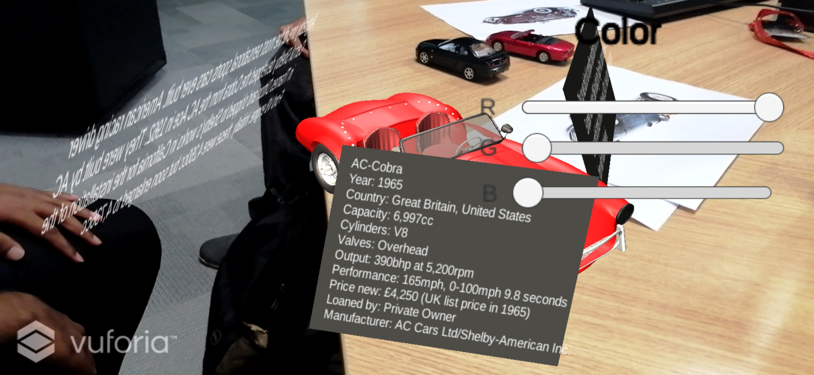
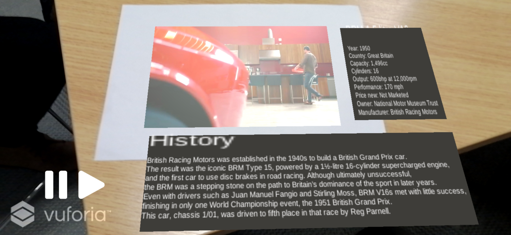

# Android AR Based Application
## Description

This project aims at developing an augmented reality application for the national motor museum located in England. AR applications implementation varies in multiple domains like construction, automobile and medical. Many organisation are taking advantage of mobile AR application as it is easy to implement and requires fewer physical materials which save the overall budget for a particular project. This paper proposed a mobile AR application that improves the visiting experience for a museum. 

###### **Unity**

Unity was picked as the principal software tool for developing the application since it works for both two-dimensional and three-dimensional for Virtual Reality (VR) and Augmented Reality (AR) application. Moreover, the capacity to develop onto any operating system from a comparative C++ codebase considers prototyping for both Android and iOS systems. Unity's underlying UI tools provide fast prototyping tools since the Unity Editor is a visually-based interface with instinctive drag and drop functionality. which allows objects to receive properties or even shared written scripts. Lean touch is a free asset that can be downloaded from the Unity Asset Store. Lean touch allows the user to move any object by touch.

[Install Unity](https://store.unity.com/download)

###### **Vuforia**

Vuforia is a computer vision library used for AR development and is incorporated into more current versions of Unity. There are other AR platforms, for example, ARKit and ARCore, however, they can only be implemented for iOS and Android, individually. Vuforia works with both iOS and Android, and somewhat, can be used with ARKit and ARCore in some cases, subsequently, ideal for quick development as it uses similar code for both operating systems.

[Install Vuforia](https://developer.vuforia.com/)

## External Library Used

###### **Lean Touch**

Quickly add touch controls to your game using Lean Touch ― no code required! Simply pick the components you want, customize the settings, and enjoy consistent controls across Android, iOS, and Desktop. Download [Lean Touch](https://assetstore.unity.com/packages/tools/input-management/lean-touch-30111).

**Easy To Use** ― Lean Touch was designed to be as flexible as possible, while still being easy to use. To achieve this, each component is fully modular, follows Unity’s inspector design style, has intuitively named settings, and includes detailed tooltip text. If you're a programmer then full C# source code is also included, allowing you to create and modify anything you like

**Touch Simulation** ― Lean Touch allows you to simulate and visualize touch inputs inside the Unity editor. This means you can test complex gestures like pinch and twist without deploying to your mobile device, saving you a lot of development time.

## Screenshots
  

More Screenshots can be viewed [here](Screenshots/)